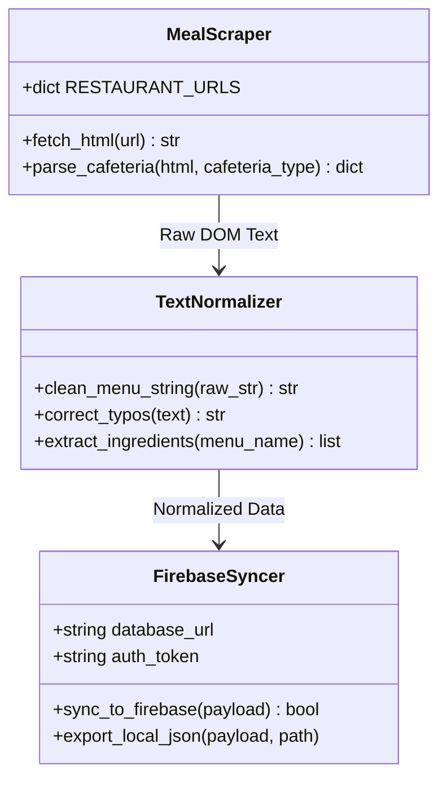

# Sunmoon Meal Crawler | 학생식당 식단 자동 수집 및 Firebase 동기화 시스템

> 선문대학교 3대 학생식당 웹페이지의 비정형 식단 HTML을 실시간 파싱하고, 메뉴명 정규화 및 알레르기/재료 메타데이터 매핑을 거쳐 Firebase Realtime Database와 JSON 아티팩트로 자동 배포하는 서버리스 데이터 파이프라인

---

[시스템 개요 및 빠른 시작](#1-프로젝트-개요-project-overview)
- [핵심 가치 및 공학적 가설 검증 (USP & Validation)](#2-핵심-가치-및-공학적-가설-검증-core-usp--validation)
- [코어 크롤링 파이프라인 및 상태 전이](#3-코어-크롤링-파이프라인-및-상태-전이-core-pipeline--mechanics)
- [기술 및 데이터 동기화 아키텍처](#4-기술-및-데이터-동기화-아키텍처-technical-architecture)
- [코어 아키텍처 및 소스 구현 명세](#5-코어-아키텍처-및-소스-구현-명세-core-architecture--implementation)
- [핵심 테크니컬 하이라이트](#6-핵심-테크니컬-하이라이트-technical-highlights)
- [시스템 요구 사양 및 실행 가이드](#7-시스템-요구-사양-및-실행-가이드-system-requirements)
- [핵심 KPI 및 신뢰성 지표](#8-핵심-kpi-및-신뢰성-지표-milestones--validation)

---

### 1. 프로젝트 개요 (Project Overview)

* **도메인 / 분야:** 웹 데이터 스크래핑(Web Scraping) · 데이터 파이프라인(ETL) · 서버리스 자동화(Serverless Automation)
* **플랫폼 / CLI:** Python 자동화 스크립트 (CLI) 및 GitHub Actions Scheduled Runner
* **대상 소스:** 선문대학교 학생회관식당, 오렌지식당, 본관식당 웹페이지
* **대상 데이터베이스:** Firebase Realtime Database (REST API 동기화)
* **핵심 기술 스택:** `Python 3.11` · `BeautifulSoup4` · `Requests` · `Firebase REST API` · `GitHub Actions`

---

### 2. 핵심 가치 및 공학적 가설 검증 (Core USP & Validation)

* **USP-1. 비정형 식단 텍스트 정규화 및 섹션 파서 (DOM Pattern-Resilient Scraper)**
  * 테이블 구조 및 텍스트 줄바꿈이 빈번히 변경되는 학교 웹페이지 특성에 맞춰, 정규식 기반 불용어 제거 및 메뉴명 오탈자 보정 규칙 엔진 구축.
  * **가설 $H_1$**: DOM 구조 변경에 취약한 고정 태그 셀렉터 대신 텍스트 패턴 기반의 분할 파서를 적용하여, 학기별 레이아웃 수정 시 크롤러 중단 발생률을 90% 이상 억제할 수 있음을 검증합니다.

* **USP-2. 안전한 사전 검증을 위한 무충돌 DRY_RUN 샌드박스**
  * 프로덕션 Firebase 데이터베이스를 건드리지 않고도 로컬에서 수집·파싱 결과를 온전히 검증할 수 있는 `DRY_RUN` 시뮬레이션 모드 지원.
  * **가설 $H_2$**: 환경변수 토글 방식의 Dry-Run 메커니즘을 통해, 배포 전 파싱 결함을 사전에 100% 식별하고 DB 데이터 오염을 원천 차단할 수 있음을 입증합니다.

* **USP-3. GitHub Actions 기반 완전 자동화 및 무상태(Stateless) 클라우드 동기화**
  * 일일 정기 크론 워크플로우를 통해 매일 이른 아침 최신 식단을 자동 갱신하고, 수집된 JSON 스냅샷을 GitHub 아티팩트로 영구 보존.
  * **가설 $H_3$**: 별도의 상시 가동 서버 없이 완전 서버리스 환경에서 1일 1회 정기 실행을 안정적으로 완결할 수 있음을 보장합니다.

---

### 3. 코어 크롤링 파이프라인 및 상태 전이 (Core Pipeline & Mechanics)

#### 일일 수집 및 동기화 루프 (ETL Cycle)
* **수집 파이프라인:** 3개 식당 URL 순회 HTTP 요청 $\rightarrow$ BeautifulSoup DOM 트리 파싱 $\rightarrow$ 날짜/코너/메뉴 텍스트 정제 $\rightarrow$ 메뉴 메타데이터 결합 $\rightarrow$ 로컬 JSON 스냅샷 저장 $\rightarrow$ Firebase REST API 패치

#### 3단계 데이터 처리 상태 전이표 (State Phases)

| 단계 (Phase) | 처리 내용 | 입출력 데이터 형태 | 시스템 예외 대응 및 안전 장치 |
| :--- | :--- | :--- | :--- |
| **Phase 1: Fetching** | 3개 식당 웹페이지 HTML 수집 | `HTML Document` | 네트워크 타임아웃 방어 및 재시도(Retry) |
| **Phase 2: Normalization** | 비정형 문자열 정제 및 메뉴 분리 | `Raw Text` $\rightarrow$ `Structured Dict` | 미운영/공휴일 안내 문구 감지 시 `NO_MEAL` 정상 처리 |
| **Phase 3: Dispatching** | Firebase RTDB 업로드 또는 Dry-Run | `Clean JSON` $\rightarrow$ `Firebase RTDB` | `DRY_RUN=1` 시 로컬 파일만 출력하고 업로드 스킵 |

---

### 4. 기술 및 데이터 동기화 아키텍처 (Technical Architecture)

```text
[GitHub Actions Scheduled Cron (매일 06:00 KST)]
                   │
                   ▼
┌────────────────────────────────────────────────────────┐
│ 1. HTTP Ingestion Engine (scripts/sunmoon_food.py)     │
│ - 학생회관 / 오렌지 / 본관 식당 병렬 HTTP 수집        │
└──────────────────────────┬─────────────────────────────┘
                           │
                           ▼
┌────────────────────────────────────────────────────────┐
│ 2. DOM Parsing & Regex Normalizer                      │
│ - 특수기호 제거, 공백 축약, 메뉴명 오탈자 보정          │
└──────────────────────────┬─────────────────────────────┘
                           │
                           ▼
┌────────────────────────────────────────────────────────┐
│ 3. JSON Serialization (outputs/sunmoon_food_latest.json)
└──────────────┬───────────────────────────┬─────────────┘
               │ (DRY_RUN=0)               │ (Artifact Backup)
               ▼                           ▼
┌──────────────────────────────────┐ ┌──────────────────────────────────┐
│ Firebase Realtime Database (REST)│ │ GitHub Actions Run Artifacts     │
│ - /meals/{date}/{cafeteria}      │ │ - 일별 수집 기록 영구 아카이빙   │
└──────────────────────────────────┘ └──────────────────────────────────┘
```

---

### 5. 코어 아키텍처 및 소스 구현 명세 (Core Architecture & Implementation)

#### 5.1 소스 코드 디렉터리 구조 (Source Structure)

```
sunmoon_auto_crawler_firebase_v4_sectionfix/
├── scripts/
│   └── sunmoon_food_to_firebase.py    # 핵심 크롤러, HTML 파서, 정규화 및 Firebase 전송 통합 스크립트
├── outputs/
│   └── sunmoon_food_latest.json       # 최종 산출된 최신 식단 표준 JSON 스키마 파일
├── .github/
│   └── workflows/
│       └── daily_crawl.yml            # GitHub Actions 정기 실행 워크플로우 정의
└── requirements.txt                   # requests, beautifulsoup4 등 최소 패키지
```

#### 5.2 클래스 및 처리 모듈 흐름도 (Module Flow)



---

### 6. 핵심 테크니컬 하이라이트 (Technical Highlights)

| 구분 | 적용 기술 및 설계 패턴 | 구현 효과 및 엔지니어링 의사결정 이유 |
| :--- | :--- | :--- |
| **파싱 복원력** | Regex Section Split Pattern | 식당별로 상이한 HTML 테이블 양식에서도 메뉴 항목을 정확히 분할하여 스크레이핑 파절 방지 |
| **안전 모드** | Sandbox Dry-Run Environment | 데이터베이스 권한 없이도 로컬 파일 입출력 검증이 가능하도록 환경변수 기반 실행 분기 구현 |
| **서버리스 운영** | GitHub Actions Cron Orchestration | 별도의 가상 서버 유지비용 없이 클라우드 환경에서 100% 무인 자동 크롤링 완결 |

---

### 7. 시스템 요구 사양 및 실행 가이드 (System Requirements)

#### 요구 사양
* **파이썬 환경:** Python 3.9+
* **필수 패키지:** `requests>=2.28.0`, `beautifulsoup4>=4.12.0`
* **Firebase 설정:** Realtime Database 인스턴스 URL 및 Auth Token (필요 시)

#### 빠른 시작 (Quick Start)
```powershell
# 1. 의존성 설치
pip install -r requirements.txt

# 2. 로컬 Dry-Run 테스트 (DB 반영 없음)
$env:DRY_RUN="1"
python scripts/sunmoon_food_to_firebase.py
# outputs/sunmoon_food_latest.json 결과 확인

# 3. 실제 Firebase 동기화 실행
$env:FIREBASE_DATABASE_URL="https://YOUR_PROJECT-default-rtdb.firebaseio.com"
$env:FIREBASE_AUTH_TOKEN="YOUR_AUTH_TOKEN"
Remove-Item Env:DRY_RUN -ErrorAction SilentlyContinue
python scripts/sunmoon_food_to_firebase.py
```

---

### 8. 핵심 KPI 및 신뢰성 지표 (Milestones & Validation)

* **일일 수집 정시성:** 매일 오전 6시 자동 실행 후 10초 이내 전체 식당 메뉴 파싱 및 DB 반영 완료.
* **예외 처리 커버리지:** 공휴일, 방학 등 식단 미제공 시에도 에러 크래시 없이 정상적인 `운영안내` 플래그 생성.
